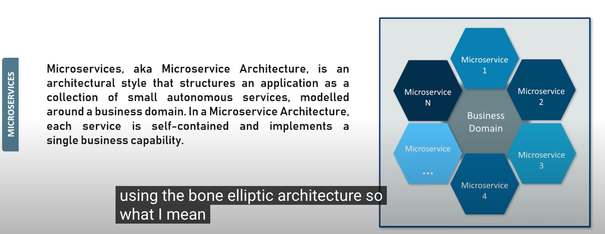

- [Soft](#soft)
  - [Tell about Your self?](#tell-about-your-self)
  - [Technical interview: Tell me about your self and within 3-4 years where you want to see your self.](#technical-interview-tell-me-about-your-self-and-within-3-4-years-where-you-want-to-see-your-self)
  - [Tell me about a time when you had a person that was hampering your progress as a team](#tell-me-about-a-time-when-you-had-a-person-that-was-hampering-your-progress-as-a-team)
  - [If you had a superpower what would it be and why?](#if-you-had-a-superpower-what-would-it-be-and-why)
  - [Tell me about yourself and what led you to Revature?](#tell-me-about-yourself-and-what-led-you-to-revature)
  - [How to resolve conflicts between team members?](#how-to-resolve-conflicts-between-team-members)
  - [team cooperation](#team-cooperation)
  - [communication](#communication)
  - [Challenges](#challenges)
  - [Strength](#strength)
  - [weakness](#weakness)
- [Core Java and OOP](#core-java-and-oop)
  - [What is DAO?](#what-is-dao)
  - [Difference between abstract classes and interfaces?](#difference-between-abstract-classes-and-interfaces)
  - [What is Encapsulation and Abstraction?](#what-is-encapsulation-and-abstraction)
  - [Analytical question: Difference between method and function..](#analytical-question-difference-between-method-and-function)
  - [How to handle class not found exception](#how-to-handle-class-not-found-exception)
  - [Describe one thin that introduced in the java 8?](#describe-one-thin-that-introduced-in-the-java-8)
  - [Tell me about functional interface?](#tell-me-about-functional-interface)
  - [Do you know Method References?](#do-you-know-method-references)
  - [Difference between lambda expression and method reference?](#difference-between-lambda-expression-and-method-reference)
  - [Tell me about Stream API?](#tell-me-about-stream-api)
  - [When is each method of software development apply?](#when-is-each-method-of-software-development-apply)
  - [What is java 8 features?](#what-is-java-8-features)
  - [Describe Abstract in OOP](#describe-abstract-in-oop)
  - [what is Java streaming?](#what-is-java-streaming)
  - [core java: polymorphism, abstract classes and interfaces(difference), AbstractionAws, aws](#core-java-polymorphism-abstract-classes-and-interfacesdifference-abstractionaws-aws)
  - [storage class](#storage-class)
  - [streams](#streams)
  - [Core java: what is JVM ?](#core-java-what-is-jvm-)
  - [What is polymorphism?](#what-is-polymorphism)
  - [Encapsulation and access modifier,the  types of access modifier,Which one is more protective?](#encapsulation-and-access-modifierthe--types-of-access-modifierwhich-one-is-more-protective)
  - [How many constructors you used in java?](#how-many-constructors-you-used-in-java)
  - [Can you do static overriding?](#can-you-do-static-overriding)
  - [How you connected your db in java?](#how-you-connected-your-db-in-java)
  - [Analytical question: Difference between method and function..](#analytical-question-difference-between-method-and-function-1)
  - [How to handle class not found](#how-to-handle-class-not-found)
  - [exception](#exception)
  - [Java 8 interfaces and features](#java-8-interfaces-and-features)
  - [MapException handling](#mapexception-handling)
  - [Difference between string buffer and String Builder](#difference-between-string-buffer-and-string-builder)
  - [What is java 8 features?](#what-is-java-8-features-1)
  - [Describe Abstract in OOP](#describe-abstract-in-oop-1)
  - [what is Java streaming?](#what-is-java-streaming-1)
  - [difrenerence between Throw and Throws?](#difrenerence-between-throw-and-throws)
- [Server Side](#server-side)
  - [What is an Http client?](#what-is-an-http-client)
  - [What is stateless?](#what-is-stateless)
  - [What is thymeleaf?](#what-is-thymeleaf)
- [Database](#database)
  - [How you connected your db in java?](#how-you-connected-your-db-in-java-1)
  - [Have you worked with Hibernate before?](#have-you-worked-with-hibernate-before)
  - [question: how to select top 15% employees base on salary](#question-how-to-select-top-15-employees-base-on-salary)
  - [What are joins?](#what-are-joins)
  - [What is the difference between a view and a table?](#what-is-the-difference-between-a-view-and-a-table)
  - [What is Relational Database Management Services (RDMS)?](#what-is-relational-database-management-services-rdms)
  - [It is not RDS](#it-is-not-rds)
  - [SQL: How to fetch top 10 salaried employees?](#sql-how-to-fetch-top-10-salaried-employees)
  - [JPA/Hibernate/JDBC](#jpahibernatejdbc)
  - [What is aggregator?](#what-is-aggregator)
  - [How many databases did I use?](#how-many-databases-did-i-use)
  - [Can I name what they are?](#can-i-name-what-they-are)
- [Spring](#spring)
  - [Srping Bean scrope?](#srping-bean-scrope)
  - [Spring framework:Tell me about spring boot](#spring-frameworktell-me-about-spring-boot)
  - [Describe annotation for each of the Spring MVC application layers?](#describe-annotation-for-each-of-the-spring-mvc-application-layers)
  - [Describe the spring application workflow](#describe-the-spring-application-workflow)
  - [actuator](#actuator)
  - [Spring framework:Tell me about spring boot](#spring-frameworktell-me-about-spring-boot-1)
  - [Do you know what stereotypes and annotations are](#do-you-know-what-stereotypes-and-annotations-are)
  - [What is dependencies Injection?](#what-is-dependencies-injection)
  - [How many types of beans in spring?](#how-many-types-of-beans-in-spring)
  - [What annotations that are use in Spring?](#what-annotations-that-are-use-in-spring)
  - [What is the difference between spring ang springboot?](#what-is-the-difference-between-spring-ang-springboot)
  - [What are the annotations that you know for spring jpa and what do they mean?](#what-are-the-annotations-that-you-know-for-spring-jpa-and-what-do-they-mean)
  - [What is an Http session?](#what-is-an-http-session)
  - [Where would you do the configuration in a spring project?](#where-would-you-do-the-configuration-in-a-spring-project)
  - [Describe the spring application workflow](#describe-the-spring-application-workflow-1)
  - [What is @RestController?](#what-is-restcontroller)
- [Git](#git)
  - [Github: merge conflict and how you handle this?](#github-merge-conflict-and-how-you-handle-this)
  - [Github: merge conflict and how you handle this?](#github-merge-conflict-and-how-you-handle-this-1)
  - [If coding conflict occurs how you going to handle this with your team mate.](#if-coding-conflict-occurs-how-you-going-to-handle-this-with-your-team-mate)
  - [What is the diff?](#what-is-the-diff)
- [Project](#project)
  - [Asked about the roles & responsibilities of current project being worked on?](#asked-about-the-roles--responsibilities-of-current-project-being-worked-on)
  - [Can you explain about your project that you did by yourself?](#can-you-explain-about-your-project-that-you-did-by-yourself)
  - [for a projectHow would you describe Java and Angular in a non-technical way?](#for-a-projecthow-would-you-describe-java-and-angular-in-a-non-technical-way)
  - [What annotation did you use in your project?](#what-annotation-did-you-use-in-your-project)
  - [CRUD](#crud)
  - [Security and permissions used for the project](#security-and-permissions-used-for-the-project)
  - [Experience with team](#experience-with-team)
  - [Talk about your project overall?](#talk-about-your-project-overall)
  - [What technologies did you used for those projects?](#what-technologies-did-you-used-for-those-projects)
  - [How would you let other developers/testers know how to access your urls?](#how-would-you-let-other-developerstesters-know-how-to-access-your-urls)
- [Angular](#angular)
  - [What bindings do you know in Angular?](#what-bindings-do-you-know-in-angular)
  - [how do you navigate from page to page in stateless Angular hooks](#how-do-you-navigate-from-page-to-page-in-stateless-angular-hooks)
  - [Are you familiar with stepping ahead, and compiling, in Angular?](#are-you-familiar-with-stepping-ahead-and-compiling-in-angular)
  - [What is Angular and could it work on Mobile?](#what-is-angular-and-could-it-work-on-mobile)
  - [What is angular hooks?](#what-is-angular-hooks)
  - [What is a service in angular?](#what-is-a-service-in-angular)
  - [What is Angular and could it work on Mobile?](#what-is-angular-and-could-it-work-on-mobile-1)
  - [What is a directive in Angular?](#what-is-a-directive-in-angular)
- [Agile](#agile)
  - [What is waterfall software lifecycle development?](#what-is-waterfall-software-lifecycle-development)
  - [What is Agile?](#what-is-agile)
  - [What is the difference between Waterfall and Agile?](#what-is-the-difference-between-waterfall-and-agile)
  - [Agile/scrum methodology...](#agilescrum-methodology)
  - [What is waterfall software lifecycle development?](#what-is-waterfall-software-lifecycle-development-1)
  - [What is Agile?](#what-is-agile-1)
  - [What is the difference between Waterfall and Agile?](#what-is-the-difference-between-waterfall-and-agile-1)
  - [When is each method of software development apply?](#when-is-each-method-of-software-development-apply-1)
- [Testing](#testing)
  - [TDD](#tdd)
  - [BDD](#bdd)
- [Devops](#devops)
  - [Iaas?](#iaas)
  - [Paas?](#paas)
  - [Saas?](#saas)
  - [Iaas vs Paas vs Saas?](#iaas-vs-paas-vs-saas)
  - [what is docker?](#what-is-docker)
  - [What Dev Ops did you use in any of your projects?](#what-dev-ops-did-you-use-in-any-of-your-projects)
  - [Jenkins](#jenkins)
  - [AWS S3 bucket](#aws-s3-bucket)
  - [How do you configure a AWS S3?](#how-do-you-configure-a-aws-s3)
  - [Cloud: what is EC2?](#cloud-what-is-ec2)
  - [Elastic Beanstalk](#elastic-beanstalk)
  - [IAM(security)](#iamsecurity)
  - [Cognito](#cognito)
  - [what is s3 bucket?](#what-is-s3-bucket)
  - [Are you familiar with AWS and Azure?](#are-you-familiar-with-aws-and-azure)
  - [What are cloud services and some known platforms?](#what-are-cloud-services-and-some-known-platforms)
  - [Have you used any other cloud servers?](#have-you-used-any-other-cloud-servers)
  - [What are cloud services and some known platforms?](#what-are-cloud-services-and-some-known-platforms-1)
  - [What are 5 different common cloud services/platforms?](#what-are-5-different-common-cloud-servicesplatforms)
  - [Sonar Cloud](#sonar-cloud)
  - [CI/CD](#cicd)
  - [Jenkins](#jenkins-1)
  - [AWS Which service you used in your project Which service include in the training One](#aws-which-service-you-used-in-your-project-which-service-include-in-the-training-one)
  - [What AWS services have you used?](#what-aws-services-have-you-used)
  - [What is the initial layer in AWS before gaining access via IP?](#what-is-the-initial-layer-in-aws-before-gaining-access-via-ip)
  - [(Firewall)What are security roles, security groups, and other functions in AWS besides RDS, and #### Region vs Country data centers in AWS?](#firewallwhat-are-security-roles-security-groups-and-other-functions-in-aws-besides-rds-and--region-vs-country-data-centers-in-aws)
  - [How do you configure a AWS S3?](#how-do-you-configure-a-aws-s3-1)
  - [What is platform as a service?](#what-is-platform-as-a-service)
  - [Are you familiar with Identity Access Manager (IAM)?](#are-you-familiar-with-identity-access-manager-iam)
  - [Are you familiar with Identity Access Manager (IAM)?](#are-you-familiar-with-identity-access-manager-iam-1)
- [Frontend](#frontend)
  - [what is CSS why it is used for?](#what-is-css-why-it-is-used-for)
  - [JavaScript](#javascript)
  - [Typescript](#typescript)
  - [JavaScript Functions](#javascript-functions)
  - [difference between a session and a cookie](#difference-between-a-session-and-a-cookie)
- [Command line](#command-line)
  - [command line used Linux command used for the project](#command-line-used-linux-command-used-for-the-project)
  - [Linux commands to switch between users and view the available space in a directory?](#linux-commands-to-switch-between-users-and-view-the-available-space-in-a-directory)
  - [Linux commands to switch between users and view the available space in a directory?](#linux-commands-to-switch-between-users-and-view-the-available-space-in-a-directory-1)
  - [06/05/2022 Questions](#06052022-questions)

### Soft
#### Tell about Your self?
  * Focus on creating a positive first impression
  * Arrive 20 minutes earlier than the interview
  * read the interview introduction
  * dress appropriately
  * good posture, always be in front of the camera, smile, and demonstrate a good manner.
  * anser:
    1. "Hi, my name is Qiang Gao.
    2. I am from Gerogetown TX, 40 mile from Austin TX.
    2. Talk the SKILLS and Qualities you have that are must for the role you are applying for.
    3. Talk about any experience or quliifications that you have that are must for the role you are applying for.
    4. Talk about any significant achievements that you have gained in your work life or personal life so far.
    5. Talk about the type of person you are and what you are going to do in the role if they hire you.
  * scripe:
    * 
#### Technical interview: Tell me about your self and within 3-4 years where you want to see your self.
#### Tell me about a time when you had a person that was hampering your progress as a team
#### If you had a superpower what would it be and why? 
#### Tell me about yourself and what led you to Revature?
#### How to resolve conflicts between team members?
#### team cooperation
#### communication
#### Challenges
#### Strength
#### weakness

### Core Java and OOP
#### What is DAO?
#### Difference between abstract classes and interfaces?
#### What is Encapsulation and Abstraction?
#### Analytical question: Difference between method and function.. 
#### How to handle class not found exception
#### Describe one thin that introduced in the java 8?
#### Tell me about functional interface?
#### Do you know Method References?
#### Difference between lambda expression and method reference?
#### Tell me about Stream API?
#### When is each method of software development apply?
#### What is java 8 features?
#### Describe Abstract in OOP
#### what is Java streaming?
#### core java: polymorphism, abstract classes and interfaces(difference), AbstractionAws, aws 
#### storage class
#### streams
#### Core java: what is JVM ? 
#### What is polymorphism? 
#### Encapsulation and access modifier,the  types of access modifier,Which one is more protective? 
#### How many constructors you used in java?  
#### Can you do static overriding?
#### How you connected your db in java?
#### Analytical question: Difference between method and function.. 
#### How to handle class not found 
#### exception
#### Java 8 interfaces and features
#### MapException handling
#### Difference between string buffer and String Builder
#### What is java 8 features?
#### Describe Abstract in OOP
#### what is Java streaming?
#### difrenerence between Throw and Throws? 

### Server Side
#### What is an Http client? 
#### What is stateless? 
#### What is thymeleaf?

### Database
#### How you connected your db in java?
#### Have you worked with Hibernate before?
#### question: how to select top 15% employees base on salary
#### What are joins?
#### What is the difference between a view and a table?
#### What is Relational Database Management Services (RDMS)? 
#### It is not RDS
#### SQL: How to fetch top 10 salaried employees?
#### JPA/Hibernate/JDBC 
#### What is aggregator? 
#### How many databases did I use?
#### Can I name what they are? 

### Spring
#### Srping Bean scrope?
https://www.baeldung.com/spring-bean-scopes
* definition
  * The scope of a bean defines the life cycle and visibility of that bean in the contexts we use it.
https://www.baeldung.com/spring-bean-scopes
  * singleton
  * prototype
  * request
  * session
  * application
  * websocket

#### Spring framework:Tell me about spring boot 

#### Describe annotation for each of the Spring MVC application layers?
  * https://www.youtube.com/watch?v=xkDBaldNki4
  * As the name suggests, it's a module of the Spring framework dealing with the Model-View-Controller or MVC pattern. It combines all the advantages of the MVC pattern with the convenience of Spring.
  * Spring MVC annotation
    * https://www.baeldung.com/spring-mvc-annotations
#### Describe the spring application workflow
#### actuator
#### Spring framework:Tell me about spring boot
#### Do you know what stereotypes and annotations are
#### What is dependencies Injection?
#### How many types of beans in spring?
#### What annotations that are use in Spring? 

#### What is the difference between spring ang springboot? 
#### What are the annotations that you know for spring jpa and what do they mean? 
#### What is an Http session? 
#### Where would you do the configuration in a spring project? 
#### Describe the spring application workflow
#### What is @RestController? 

### Git
#### Github: merge conflict and how you handle this? 
#### Github: merge conflict and how you handle this? 
#### If coding conflict occurs how you going to handle this with your team mate.
#### What is the diff?

### Project
#### Asked about the roles & responsibilities of current project being worked on?
  * https://github.com/seaboyz/4am
  1. Requirements
  2. How did you decide on the framework/tools that you selected
  3. Basic structure
  4. Files, folders, libraries
  5. Basic workflow

#### Can you explain about your project that you did by yourself?
#### for a projectHow would you describe Java and Angular in a non-technical way? 
#### What annotation did you use in your project?
#### CRUD
#### Security and permissions used for the project
#### Experience with team
#### Talk about your project overall? 
#### What technologies did you used for those projects?
#### How would you let other developers/testers know how to access your urls?

### Angular
#### What bindings do you know in Angular?
#### how do you navigate from page to page in stateless Angular hooks
#### Are you familiar with stepping ahead, and compiling, in Angular?
#### What is Angular and could it work on Mobile?
#### What is angular hooks? 
#### What is a service in angular? 
#### What is Angular and could it work on Mobile?
#### What is a directive in Angular?

### Agile
#### What is waterfall software lifecycle development?
#### What is Agile? 
#### What is the difference between Waterfall and Agile?
#### Agile/scrum methodology... 
#### What is waterfall software lifecycle development?
#### What is Agile? 
#### What is the difference between Waterfall and Agile?
#### When is each method of software development apply?

### Testing
#### TDD 
#### BDD

### Devops
#### Iaas?
* Inrastructure as a service
* AWS S3(Simple Storage Service)
#### Paas?
* Platform as a service
* AWS EC2(Elastic Compute Cloud)
* AWS RDS(Relational Database Service)
#### Saas?
* Software as a service
* Trello
#### Iaas vs Paas vs Saas?
* -> Ease of use increases
* -> Complexity decreases
* Iaas == Leasing a car()
  * you can choose color specs
  * you focus more what you want
  * but you have restrictions(mileage, fuel, etc)
* Paas == Car rental
  * you not really care the color specs 
  * more concerned about the price, size, specs you need
* Saas == Uber or Lyft
  * you not really care the color specs 
  * You are not driving or pay the gas.
* 
* Developer only focus on Application and Data
* Vendor focus on infrastructure and services
  * Serves
  * storage
  * virtualization
  * middleware
  * operating system
  * runtime
* Pros
  * Fast, easy
  * create delete update ease
  * cost benefit
  * tools
* Cons
  * Lack of control
  * vender locking(difficult to migrate)
  * performance scale
#### what is docker? 
https://youtu.be/Gjnup-PuquQ
* Docker is a containerization platform for distributed applications.
* 
* 
* 
#### What Dev Ops did you use in any of your projects?
* 
* 
* Deployment
* Goal
  * Development and production work together
  * Thought more alike
  * Broke down silos
  * Shared responsibility
* Definition
  * DevOps is the combination of the operations, development, and operations teams that are responsible for the overall development and operations of a software project.
  * integrates developers and operations teams in order to improve collaboration and productivity by automating infrastructure, workflows and continuously measuring application performance.
* Automation
  * automate code testing
  * automate workflows
  * automate infrastructure
  * automate everything 
  * 
  * 
#### Jenkins
#### AWS S3 bucket
#### How do you configure a AWS S3?
#### Cloud: what is EC2? 
* Elastic Compute Cloud
* Virtual computer

#### Elastic Beanstalk
* auto scale

#### IAM(security)
* Identity and Access Management
* https://youtu.be/vFB2CR7xCOM
* Identity
  * How you are represented online?
  * User as an Identity trying to gain access to the right resources and at the right time and place sercurely.
* Chanlenges
  * password management
  * alleviating identity silos
  * sequring api access
  * regulation compliance
* Identity federation
  * using a single identity across multiple systems
  * use facebook login multiple systems
  * single sing on
  * Strong authentication
  * multi factor authentication
  * account management and provisioning
    * user profile
    * user configuration
  * access control
    * role based
  * api and microservices security
  * Regulation compliance

#### Cognito
* User pool

#### what is s3 bucket?
* simple storage service
* storage
* security
* access control

#### Are you familiar with AWS and Azure?
#### What are cloud services and some known platforms?
#### Have you used any other cloud servers?
#### What are cloud services and some known platforms?
#### What are 5 different common cloud services/platforms? 
#### Sonar Cloud
#### CI/CD
* Continuous Integration/Continuous Delivery
* https://youtu.be/eB0nUzAI7M8
* Github actions
* 
#### Jenkins
https://youtu.be/LFDrDnKPOTg
#### AWS Which service you used in your project Which service include in the training One 
#### What AWS services have you used?
#### What is the initial layer in AWS before gaining access via IP? 
#### (Firewall)What are security roles, security groups, and other functions in AWS besides RDS, and #### Region vs Country data centers in AWS?
#### How do you configure a AWS S3?
#### What is platform as a service?
https://www.youtube.com/watch?v=QAbqJzd0PEE 
#### Are you familiar with Identity Access Manager (IAM)?
https://docs.oracle.com/cd/E19462-01/819-4672/adqar/index.html
#### Are you familiar with Identity Access Manager (IAM)?

### Frontend
#### what is CSS why it is used for? 
#### JavaScript
#### Typescript
#### JavaScript Functions
#### difference between a session and a cookie

### Command line
#### command line used Linux command used for the project
#### Linux commands to switch between users and view the available space in a directory?
#### Linux commands to switch between users and view the available space in a directory?

#### 06/05/2022 Questions
1. First Question was just to tell them a little about myself
2. Asked about the roles & responsibilities of current project being worked on
3. Asked to describe my P2 to them, like describe the overall application and whats function is
4. Why Strings in Java are immutable?
   * An immutable object is an object whose internal state remains constant after it has been entirely created. 
   * https://www.baeldung.com/java-string-immutable
   * The key benefits of keeping this class as immutable are 
     * caching, 
     * security, 
     * synchronization, 
     * and performance.
   * 
5. What Angular AOT compiler is?
   https://www.youtube.com/watch?v=-h_zSpjL4TY
   * AOT
     * Ahead of time compilation
     * compiles the application just in time in the broswer at the run time
     * can run the the applicaiton as long as application is dowloaded
6. What are micro-services & web-services
   https://www.parasoft.com/blog/web-api-vs-web-services-microservices-basics-differences/
   * A microservice is a small, independent, application that performs a highly focused service as well as possible.
     * Archietureal style 
     * 
     * 
   * A web service is an internet-based interface that makes the “services” of one application available to applications running on different platforms. 
     * A web service is a set of interfaces that define the functionality of an application.
     * 
   * API stands for Application Programming Interface.
    * 
7. What Java JIT compiler is?
    * JIT
     * Just in time compilation
     * compiles the application at the build time
     * browser need to download the compiler to compile the application at the run time
     * compiler is over 1 megabytes
8.  What IoC (inversion of control) is?
     * https://www.baeldung.com/inversion-control-and-dependency-injection-in-spring
     * Instead user instanciate a object(for exmple,dabase connection jpa, spring jpa create the Entitymanager for caller to use to do query or transaction ).framework will create the object for you.
     * Inversion of control is a software design principle that asserts a program can benefit in terms of pluggability, testability, usability and loose coupling if the management of an application's flow is transferred to a different part of the application.
     * The Inversion-of-Control (IoC) pattern, is about providing any kind of callback (which controls reaction), instead of acting ourself directly (in other words, inversion and/or redirecting control to external handler/controller). The Dependency-Injection (DI) pattern is a more specific version of IoC pattern, and is all about removing dependencies from your code.
   * 

9.  What Spring boot is?
10. Describe hibernate ORM
11. Asked what dependency injection is
12. Asked about SQL & general experience with it
13. Difference between collections & streams
14. Difference between Linked List & Array List
15. Can entity classes be marked as final?
16. Is “finally” guaranteed to run?
17. Can you override a private or static method in Java?
    * No, we cannot override private or static methods in Java.
    * Private methods in Java are not visible to any other class which limits their scope to the class in which they are declared.
18. Asked about RESTful API
19. Asked about what kind of exceptions I can expect to see thrown when comparing strings 
with like .compareTo() & .equals()
20. Asked about @SpringBootApplication annotation

